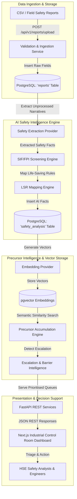
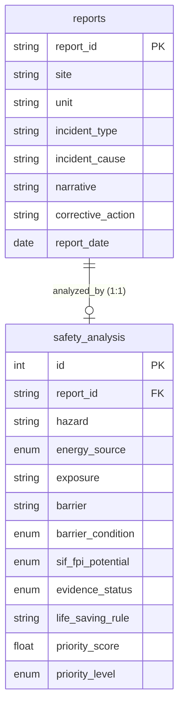

# DRIFT — Architectural Specification

## System Purpose & Vision

DRIFT is an evidence-backed HSE decision-support system designed to detect Serious Injury & Fatality (SIF) precursors in safety report text narratives.

Unlike traditional text classifiers that evaluate reports in isolation, the central product idea of DRIFT is **PRECURSOR ACCUMULATION**. A single safety report may appear minor in isolation; however, multiple reports involving the same energy mechanism, asset, activity, or barrier failure across time reveal emerging precursor patterns that precede catastrophic incidents.

---

## Core System Architecture

---

## Source Data vs. AI Representation Isolation

To guarantee data integrity and satisfy **Principle 2 (Preserve Source Data)**, the architecture enforces strict separation between raw field data and AI analytical data:

---

## Core Product Principles

1. **Evidence First**: AI safety facts are strictly annotated with evidence levels (`EXPLICIT`, `INFERRED`, `UNKNOWN`). Facts lacking narrative evidence default to `UNKNOWN`.
2. **Preserve Source Data**: Source fields (`reports`) are immutable and never overwritten by AI interpretation (`safety_analysis`).
3. **Decision Support Only**: DRIFT prioritizes reports for human safety officers; it does not replace HSE personnel or claim predictive perfection.
4. **Uncertainty is Valid**: The system explicitly supports `YES`, `NO`, and `UNCERTAIN` outputs.
5. **Human-in-the-Loop**: Ambiguous and high-risk precursor findings populate a dedicated HSE Human Review Queue.
