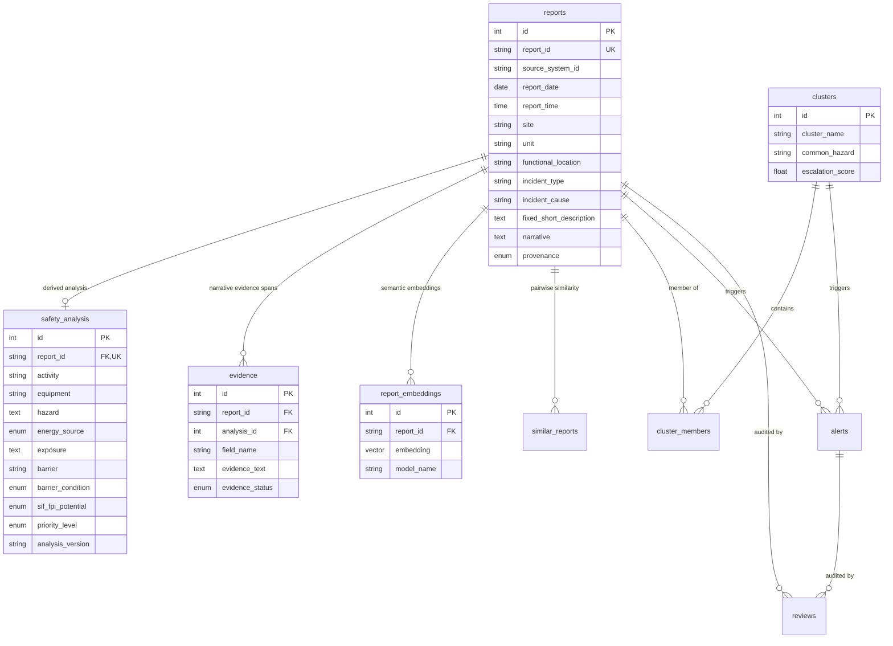

# Data Model & Schema Specification — Phase 2

## 1. Domain Overview & Core Principles

The **OIL SENTINEL** database schema strictly enforces the separation between **RAW SOURCE REPORT DATA** and **AI-DERIVED SAFETY ANALYSIS**.

1. **Source Data Preservation**: Raw source reports in [`reports`](#2-raw-source-report-schema-reports-table) preserve exact field reporting without modification (e.g. `incident_cause = "IMPROPER MATERIAL HANDLING"`).
2. **Missing vs Uncertainty**: Missing source fields are stored strictly as `NULL` (`None`). Analytical uncertainty is represented by explicit `UNKNOWN` / `UNCERTAIN` enums in [`safety_analysis`](#3-ai-derived-safety-facts-schema-safety_analysis-table).
3. **Traceability & Evidence**: Extracted safety facts link back to narrative text via structured evidence spans in [`evidence`](#4-evidence-schema-evidence-table).
4. **pgvector Support**: Dense vector embeddings in [`report_embeddings`](#5-embeddings-schema-report_embeddings-table) enable semantic precursor clustering.

---

## 2. Mermaid Entity-Relationship (ER) Diagram

---

## 3. Schema Definitions

### 3.1 Raw Source Reports (`reports` Table)

| Field | Type | Description | Nullable |
| :--- | :--- | :--- | :--- |
| `id` | INTEGER | Primary surrogate key | No |
| `report_id` | VARCHAR(100) | Canonical report identifier | No (Unique) |
| `source_system_id` | VARCHAR(100) | Source system identifier | Yes |
| `report_date` | DATE | Date report was logged | Yes |
| `report_time` | TIME | Time report was logged | Yes |
| `site` | VARCHAR(150) | Operational site location | Yes |
| `unit` | VARCHAR(150) | Operational unit | Yes |
| `shift` | VARCHAR(50) | Work shift (DAY / NIGHT) | Yes |
| `functional_location` | VARCHAR(200) | SAP/ERP functional location | Yes |
| `functional_location_description` | TEXT | Description of functional location | Yes |
| `item_no` | VARCHAR(100) | Item reference number | Yes |
| `incident_type` | VARCHAR(100) | Source incident classification | Yes |
| `incident_sub_type` | VARCHAR(100) | Source sub-type | Yes |
| `incident_cause` | VARCHAR(200) | Source cause attribution | Yes |
| `fixed_short_description` | TEXT | Short summary line | Yes |
| `line_item` | VARCHAR(50) | Line item code | Yes |
| `narrative` | TEXT | Verbatim text narrative | No |
| `corrective_action` | TEXT | Corrective action taken | Yes |
| `preventive_action` | TEXT | Preventive action taken | Yes |
| `man_hours` | FLOAT | Exposure man-hours | Yes |
| `lost_time` | FLOAT | Hours lost | Yes |
| `operational_time_lost` | FLOAT | Downtime hours | Yes |
| `financial_implication` | FLOAT | Cost impact | Yes |
| `currency` | VARCHAR(10) | Currency code (default: INR) | Yes |
| `affected_person_type` | VARCHAR(50) | Person type affected | Yes |
| `employee_or_contractor` | VARCHAR(50) | Employment status | Yes |
| `designation` | VARCHAR(100) | Role/designation | Yes |
| `contractor_name` | VARCHAR(150) | Contracting firm name | Yes |
| `actual_outcome` | VARCHAR(150) | Recorded actual outcome | Yes |
| `source_file` | VARCHAR(255) | CSV filename ingested | Yes |
| `source_row_number` | INTEGER | Line number in CSV | Yes |
| `provenance` | ENUM | `SYNTHETIC`, `REFERENCE`, `OIL_EXPORT`, `OTHER` | No |

---

### 3.2 AI Safety Analysis (`safety_analysis` Table)

| Field | Type | Controlled Enum / Range | Nullable |
| :--- | :--- | :--- | :--- |
| `id` | INTEGER | Primary surrogate key | No |
| `report_id` | VARCHAR(100) | FK to `reports.report_id` | No (Unique) |
| `activity` | VARCHAR(200) | Work activity performed | Yes |
| `equipment` | VARCHAR(200) | Component involved | Yes |
| `hazard` | TEXT | Extracted energy hazard mechanism | Yes |
| `energy_source` | ENUM | `MECHANICAL`, `KINETIC`, `GRAVITATIONAL`, `PRESSURE`, `ELECTRICAL`, `THERMAL`, `CHEMICAL`, `HYDROCARBON`, `STORED_ENERGY`, `VEHICLE_MOTION`, `UNKNOWN` | Yes |
| `exposure` | TEXT | Personnel position in energy trajectory | Yes |
| `exposure_location` | VARCHAR(200) | Physical location of exposure | Yes |
| `barrier` | VARCHAR(150) | Primary safety barrier | Yes |
| `barrier_condition` | ENUM | `INTACT`, `DEGRADED`, `FAILED`, `ABSENT`, `UNKNOWN` | Yes |
| `potential_consequence` | TEXT | Potential consequence | Yes |
| `sif_fpi_potential` | ENUM | `YES`, `NO`, `UNCERTAIN` | Yes |
| `sif_confidence` | FLOAT | Confidence (0.0 – 1.0) | Yes |
| `evidence_status` | ENUM | `EXPLICIT`, `INFERRED`, `UNKNOWN` | Yes |
| `evidence_span` | TEXT | Substring span in narrative | Yes |
| `reason_code` | VARCHAR(100) | Screening logic rule code | Yes |
| `life_saving_rule` | VARCHAR(50) | Life-Saving Rule code | Yes |
| `priority_score` | FLOAT | Prioritization score (0.0 – 100.0) | Yes |
| `priority_level` | ENUM | `ROUTINE`, `SAFETY_REVIEW`, `HIGH_PRIORITY_SIF_FPI_PRECURSOR`, `CRITICAL`, `UNCERTAIN` | Yes |
| `analysis_version` | VARCHAR(50) | Analysis schema version | No |
| `model_name` | VARCHAR(100) | LLM / provider name | Yes |
| `analyzed_at` | DATETIME | Timestamp of AI run | Yes |

---

### 3.3 Evidence (`evidence` Table)

| Field | Type | Description | Nullable |
| :--- | :--- | :--- | :--- |
| `id` | INTEGER | Primary key | No |
| `report_id` | VARCHAR(100) | FK to `reports.report_id` | No |
| `analysis_id` | INTEGER | FK to `safety_analysis.id` | Yes |
| `field_name` | VARCHAR(100) | Target field (e.g. hazard, exposure) | No |
| `evidence_text` | TEXT | Substring extracted from narrative | No |
| `start_offset` | INTEGER | Character start index | Yes |
| `end_offset` | INTEGER | Character end index | Yes |
| `evidence_status` | ENUM | `EXPLICIT`, `INFERRED`, `UNKNOWN` | No |
| `confidence` | FLOAT | Fact confidence score (0.0 – 1.0) | Yes |

---

### 3.4 Auxiliary Tables (`report_embeddings`, `similar_reports`, `clusters`, `cluster_members`, `alerts`, `reviews`)

- **`report_embeddings`**: Dense vector representation (768d pgvector).
- **`similar_reports`**: Pairwise report similarity links.
- **`clusters`**: Precursor clusters grouping safety mechanisms across time.
- **`cluster_members`**: Mapping reports to analytical precursor clusters.
- **`alerts`**: Analytical risk alerts (`SIF_REVIEW`, `PATTERN_ESCALATION`, `BARRIER_WEAKNESS`).
- **`reviews`**: Human-in-the-loop audit decisions.
